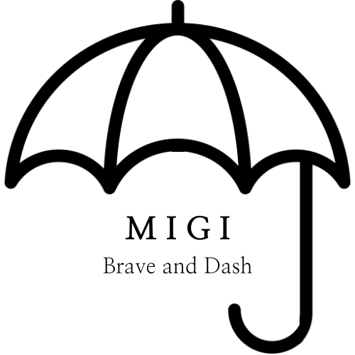

## 
 

## 
Mingi Kim (Migi) 

안녕하세요 👋  
제주 서쪽에 사는 신입 프론트엔드 개발자입니다.  
잘 부탁드려요 🤞  
# 

### 🔨 Tech Stack 🔧  
 
</a>&nbsp;
</a>&nbsp;
</a>&nbsp; 
</a>&nbsp;
</a>&nbsp; 
 

# 

<!--
**devmigi619/devmigi619** is a ✨ _special_ ✨ repository because its `README.md` (this file) appears on your GitHub profile.

Here are some ideas to get you started:

- 🔭 I’m currently working on ...
- 🌱 I’m currently learning ...
- 👯 I’m looking to collaborate on ...
- 🤔 I’m looking for help with ...
- 💬 Ask me about ...
- 📫 How to reach me: ...
- 😄 Pronouns: ...
- ⚡ Fun fact: ...
-->
